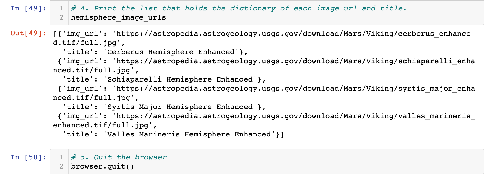
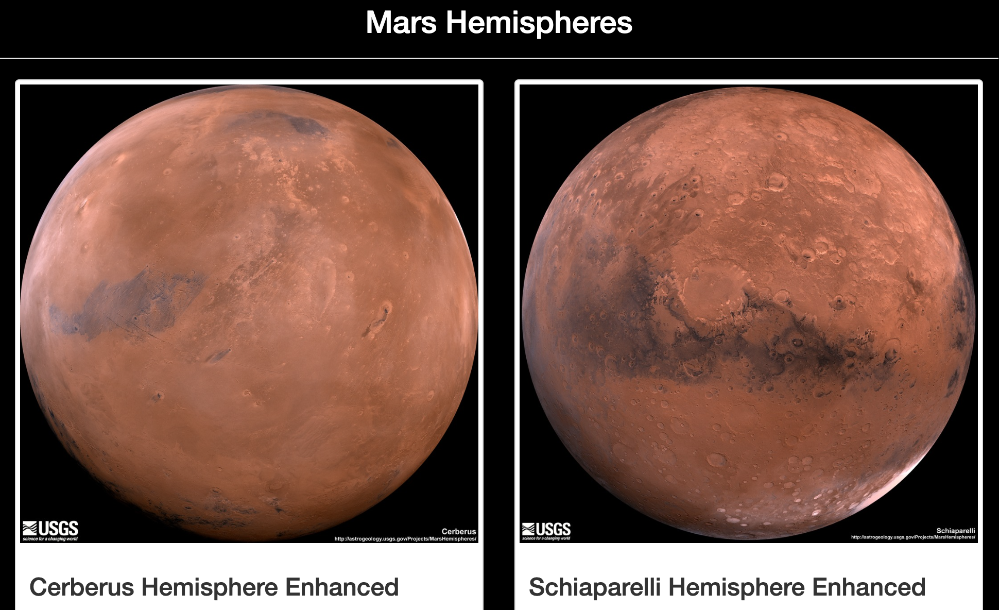
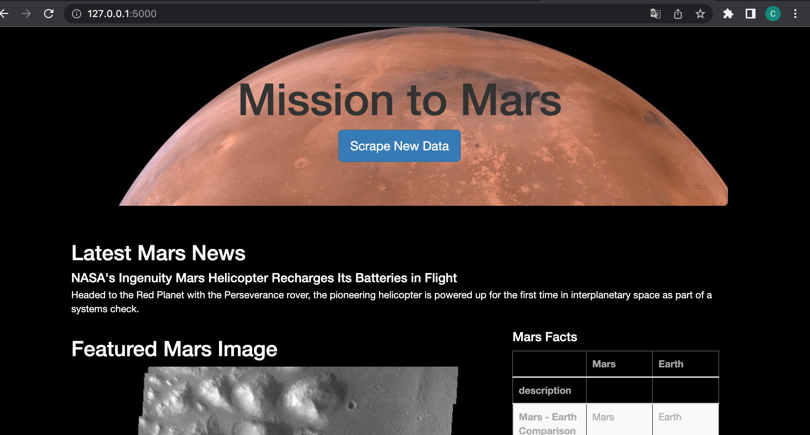
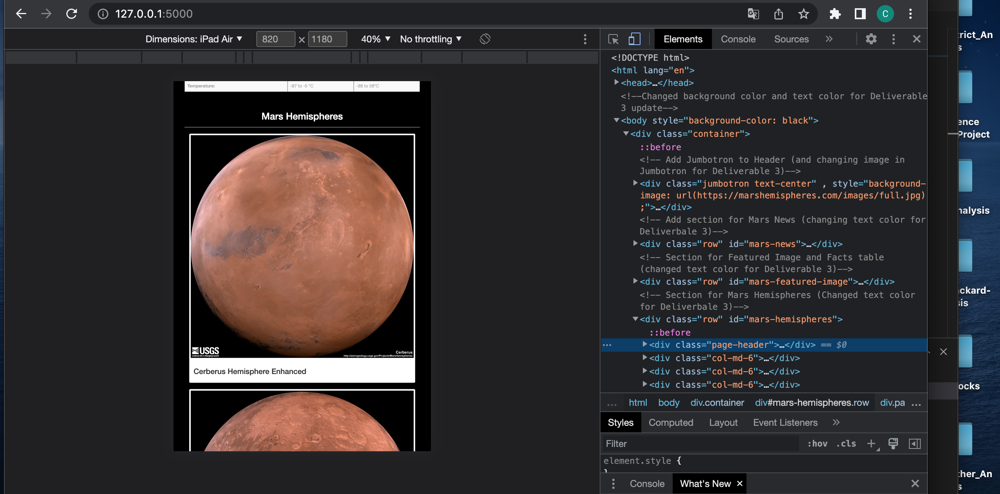

# Mission-to-Mars

# Overview 
The purpose of this Challenge is to imporve the web app by making it look good and fuction well by adding more polish to the app itself. This was done by retrieve the URLs of the images of Mars, adjusting the web app to include images themselves, and finally, to customize the web app to make it look presentable as possible using Bootstrap.

# Results 
## Hemisphere URLs for Images (Deliverable 1)

## Updated Web App with Mars Hemispheres and Titles (Deliverable 2)

## Bootstrap conponents (Deliverable 3)
### Background color, text color, and Jumbotron customization

# Resources
- Jupyter Notebook 
- Python 
- MongoDB 
- Visual Studio Code 
- Flask 
